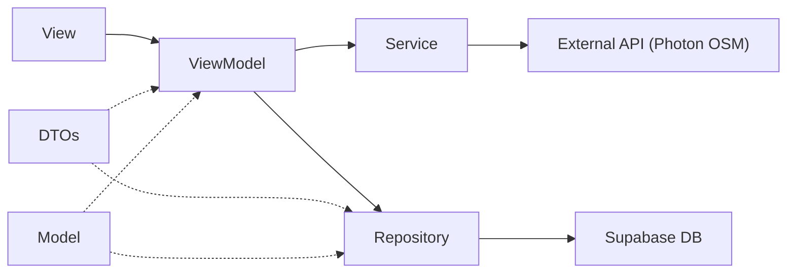

# CLAUDE.md

This file provides guidance to Claude Code (claude.ai/code) when working with code in this repository.

## Project

MbengkelIn is a SwiftUI iOS app (university MAD ALP project) that connects vehicle owners with motor/car workshops ("bengkel"). It is a single Xcode project — no Swift Package Manager manifest, no CocoaPods, no fastlane. The only third-party dependency is `supabase-swift`, wired via Xcode's package manager (see `MbengkelIn.xcodeproj/project.pbxproj`). A project-local `.mcp.json` also wires the Supabase MCP server (project ref `nerrnpbopdfrdcfvjowx`) for schema/log access.

The backend is also versioned in-repo under `supabase/`:

- `supabase/migrations/*.sql` — SQL migrations: tables, RLS policies, `SECURITY DEFINER` RPCs, status enums, and triggers. These target the remote project; there is no local Supabase stack wired up.
- `supabase/functions/` — Deno edge functions versioned in-repo (`payment`, `midtrans-webhook`, plus `_shared/midtrans.ts`). The `bidding` edge function (the mechanic order feed + bid placement) is deployed to the remote project but is **not** checked in — inspect/redeploy it via the Supabase MCP.
- `scripts/restart-all.sh` — multi-simulator build/install/launch helper (see Build / Run).

## Build / Run

Open in Xcode and run the `MbengkelIn` scheme on an iOS Simulator:

```sh
open MbengkelIn.xcodeproj
# or from CLI:
xcodebuild -project MbengkelIn.xcodeproj -scheme MbengkelIn \
  -destination 'platform=iOS Simulator,name=iPhone 15' build
```

The bundle id is `com.reisoemanto.MbengkelIn`. `scripts/restart-all.sh` (also exposed as the `/restart-all` skill) shuts down all simulators, boots three devices, builds once into `build/` (`-derivedDataPath`), then installs + relaunches the app on all three — useful for testing multi-user flows (customer ↔ bengkel, bidding, chat) side by side.

The project has 6 targets: the `MbengkelIn` iOS app, a fully-implemented `MbengkelInWatchOS Watch App` (a customer-only companion — see **watchOS Companion** below), and four test targets (`MbengkelInUnitTests`, `MbengkelInUITests`, and the two watchOS test bundles). **The four test targets are still empty Xcode template stubs** — there are no tests, no lint config, and no CI. The watch target uses Xcode **file-system-synchronized groups**, so any `.swift` file added under `MbengkelInWatchOS Watch App/` is auto-included in the target with no `.pbxproj` edit. The watch app links **no** Supabase package; it communicates only with the paired iPhone over `WatchConnectivity`.

The Supabase URL and publishable key are hard-coded at the top of `MbengkelIn/MbengkelInApp.swift` as a module-level `let supabase = SupabaseClient(...)` — every Repository and Service imports that global directly rather than receiving a client via init.

---

## Architecture (Layered MVVM)

This project uses a **layered MVVM** architecture. All layers live under `MbengkelIn/`:



| Layer          | Folder          | Role                                                                                                 | Depends On                           |
| -------------- | --------------- | ---------------------------------------------------------------------------------------------------- | ------------------------------------ |
| **Model**      | `Models/`       | Domain entity structs matching DB schema (`Codable + Identifiable`)                                  | Foundation                           |
| **DTO**        | `Models/DTOs/`  | `Encodable`/`Decodable` payloads for insert/update/response — **never** inline structs in ViewModels | Models                               |
| **Protocol**   | `Protocols/`    | Shared behavior contracts (e.g. `LocationSearchable`)                                                | Models                               |
| **Repository** | `Repositories/` | Single-purpose Supabase **database** CRUD calls (`supabase.from("table")`)                           | DTOs, Models, `supabase` global      |
| **Service**    | `Services/`     | External API / SDK calls **not** tied to a Supabase table (Auth SDK, Storage, Photon OSM)            | DTOs, `supabase` global              |
| **ViewModel**  | `ViewModels/`   | Orchestrates Repository + Service; holds `@Published` UI state; **never** calls `supabase` directly  | Repositories, Services, DTOs, Models |
| **View**       | `Views/`        | SwiftUI views — Pages (full screens) and Components (reusable)                                       | ViewModels                           |

### Key Rules

1. **ViewModels never touch `supabase` directly** — all DB operations go through a Repository, all SDK/API operations go through a Service.
2. **No inline `Encodable` structs in ViewModels** — always use a named DTO from `Models/DTOs/`.
3. **Models are pure data** — `Codable + Identifiable` structs with `CodingKeys` for snake_case mapping. No business logic.
4. **Repositories are stateless** — they receive parameters and return/throw. No `@Published` properties.
5. **Services are stateless** — same as Repositories but for non-DB operations.
6. **ViewModels are `@MainActor`** — all ViewModels are annotated `@MainActor` (either explicitly or via `NSObject` + `CLLocationManagerDelegate` pattern) and use `ObservableObject` with `@Published` properties.

---

## Supabase Usage Conventions

### Global Client

```swift
// MbengkelInApp.swift — module-level constant
let supabase = SupabaseClient(
  supabaseURL: URL(string: "https://nerrnpbopdfrdcfvjowx.supabase.co")!,
  supabaseKey: "sb_publishable_..."
)
```

All Repositories and Services reference this global directly.

### User ID Convention

The user PK is the Supabase `auth.user.id` UUID, **lowercased**:

```swift
let uid = session.user.id.uuidString.lowercased()
```

Always use `.lowercased()` when filtering by user ID.

### Tables Touched

| Table              | Repository                                                                                      | Description                                                                                                                                                    |
| ------------------ | ----------------------------------------------------------------------------------------------- | -------------------------------------------------------------------------------------------------------------------------------------------------------------- |
| `users`            | `UserRepository`                                                                                | User profile (name, profile image, balance, role, bank details)                                                                                                |
| `vehicles`         | `VehicleRepository`                                                                             | Customer vehicles                                                                                                                                              |
| `bengkels`         | `BengkelRepository`                                                                             | Workshop records with JSONB `offered_services`                                                                                                                 |
| `service_requests` | `OrderRepository`                                                                               | Orders: create, fetch, delete, `fetchActiveOrder`, ratings (`submitRating`), `mark_order_completed` RPC, `fetchTodaysEarnings` (bengkel "Pendapatan Hari Ini") |
| `bids`             | `OrderRepository` (`fetchAcceptedBid`, `fetchPendingBids`, `acceptBid`) + inline in bidding VMs | Mechanic bid records (bid CRUD still partly inline in the bidding VMs)                                                                                         |
| `chat_messages`    | `ChatRepository`                                                                                | Per-order chat between customer and bengkel                                                                                                                    |
| `order_locations`  | `OrderLocationRepository`                                                                       | Live location of assigned bengkel during an in-progress order                                                                                                  |
| `topups`           | `TopupRepository`                                                                               | Balance top-up transactions (written by edge functions, read-own by client)                                                                                    |
| `withdrawals`      | `WithdrawalRepository`                                                                          | Payout requests (created via `request_withdrawal` RPC)                                                                                                         |

### Storage Buckets

| Bucket         | Service          | Usage                                                                             |
| -------------- | ---------------- | --------------------------------------------------------------------------------- |
| `avatars`      | `StorageService` | Profile image uploads (`{uid}/profile.jpg`)                                       |
| `order-photos` | `StorageService` | Order photos, e.g. flat-tire photos (`{uid}/{uuid}.jpg`); deleted on order cancel |
| `chat-images`  | `StorageService` | Images sent in order chat (`{serviceRequestId}/{uuid}.jpg`)                       |

### Auth Conventions

- Sign-up writes `name` and `phone_number` into `auth.users.user_metadata`.
- `fetchUser()` merges metadata onto the row from the `users` table.
- The `users` row is created by a **Postgres trigger on signup** — not inserted from the client.
- Account deletion re-authenticates with password before deleting the `users` row, then signs out. The auth user itself is not deleted from the client.

### Supabase Edge Functions

| Function           | Used By                      | Purpose                                                                                                            |
| ------------------ | ---------------------------- | ------------------------------------------------------------------------------------------------------------------ |
| `bidding`          | `BengkelBiddingViewModel`    | Fetches nearby orders (`ordersForMechanic`) and places bids (`placeBid`) — invoked via `supabase.functions.invoke` |
| `payment`          | `PaymentService.createTopup` | Creates a Midtrans Snap transaction for a balance top-up; returns a redirect/snap URL                              |
| `midtrans-webhook` | (Midtrans → Supabase)        | Receives Midtrans settlement callbacks; verifies signature and credits balance via `increment_user_balance`        |

**Server-side RPCs (`SECURITY DEFINER`, defined in `supabase/migrations/`):** `mark_order_completed`, `increment_user_balance`, `request_withdrawal`, `reject_withdrawal`, and the `nearby_*` distance functions. Money-moving logic (balance hold/credit/refund) lives in these RPCs/triggers — never trust client-passed user ids; they use `auth.uid()`.

### Realtime Subscriptions

All live updates use a **true Supabase Realtime connection** (`postgresChange`). **Do NOT use polling** — never add `Task.sleep` refresh loops, timers, or "poll every N seconds" fallbacks. If data is not updating live, fix the realtime prerequisites below rather than reaching for a poll.

```swift
let channel = supabase.channel("channel-name")
let stream = channel.postgresChange(AnyAction.self, schema: "public", table: "tableName", filter: "...")
Task {
    await channel.subscribe()
    for await _ in stream {
        await self.refreshData()
    }
}
```

**For realtime to actually deliver events, BOTH must hold:**

1. **Publication** — the table must be in the `supabase_realtime` publication: `alter publication supabase_realtime add table public.<table>;`
2. **RLS** — Realtime enforces RLS per subscriber, so the subscribing user must be able to `SELECT` the changed rows. If a user must receive rows they don't own (e.g. a mechanic receiving other customers' open orders), add a policy that grants that read. Example: `service_requests` has an `authenticated`-role policy allowing SELECT of open, unassigned requests (`status = 'To Do' and bengkel_id is null`) so mechanics get new-order events instantly without polling the edge function.

Tables currently published to `supabase_realtime` include `service_requests`, `bids`, `chat_messages`, `order_locations`, `topups`, `withdrawals`, and `bengkels`. Filtered UPDATE/DELETE events need `replica identity full` on the table so the row columns are present for the subscription filter to match.

Realtime channel subscriptions are set up **inside ViewModels** (e.g. `ChatViewModel`, `OrderTrackingViewModel`, `OrderCompletionViewModel`, `CustomerBiddingViewModel`, `BengkelBiddingViewModel`, `BengkelViewModel`, `PaymentViewModel`) — and, exceptionally, in the app-level `WatchSessionManager`, which observes the customer's active order to push snapshots to the watch. This is the one accepted place a ViewModel references `supabase` directly (for `.channel` / `.functions.invoke`); all table CRUD still goes through a Repository.

Always tear down channels on view `.onDisappear` / VM `deinit` via `supabase.removeChannel(channel)`.

---

## App Entry & Session Flow

`MbengkelInApp` → `ContentView` owns the single `@StateObject AuthViewModel`.

`ContentView` gates on `authViewModel.userSession`:

- **nil** → shows `LoginView`
- **non-nil** → shows a 4-tab `TabView`:
  1. **Dashboard** (Beranda / Bengkel)
  2. **Payment** (Saldo / Pendapatan) — Midtrans top-up, withdrawals, live balance (`PaymentView`)
  3. **History** (Riwayat / Pesanan) — past **and** active orders; tapping an active order re-enters it (`HistoryView` → `CustomerHistoryView` / `BengkelHistoryView`)
  4. **Profile**

(Payment and History are fully implemented — they are no longer placeholders.)

`AuthViewModel` also exposes `appMode: AppMode { .customer, .bengkel }`. For `PROVIDER` accounts a segmented mode picker is rendered above the tabs in `ContentView`, and the Dashboard switches content based on this mode — the same logged-in user can toggle between customer and bengkel modes. `ContentView` also (a) refreshes `currentUser` on appear / `scenePhase == .active` so the dashboard balance stays current, and (b) starts the watch state observer via `WatchSessionManager.shared.startObserving(customerId:)` whenever a session exists (see **watchOS Companion**).

---

## watchOS Companion (`MbengkelInWatchOS Watch App`)

A **customer-only** Apple Watch app that mirrors an in-flight order and lets the customer act on it. It has **no text entry** (no login, no price typing, no review comments) and links **no** Supabase SDK.

**Architecture — "phone as brain":** the watch holds no Supabase session. The iPhone (already the authenticated client) does all DB/realtime work and bridges to the watch over `WatchConnectivity` (`WCSession`):

```
WATCH (WatchConnectivityClient)                 PHONE (WatchSessionManager.shared)
 sendMessage(approveBid/finishJob/      ──▶      executes via OrderRepository/UserRepository
   submitRating/requestState)
 applicationContext(WatchOrderState)     ◀──      Supabase Realtime observer on the customer's
                                                   active service_request + its bids → pushes a snapshot
 transferUserInfo(notif)                 ◀──      NotificationService forwards every local notification
```

- **Phone side:** `Services/WatchConnectivity/WatchSessionManager.swift` (+ `+Commands`, `+Delegate`) — `@MainActor` singleton, `WCSessionDelegate`. Observes the customer's active order via Realtime, encodes a `WatchOrderState` (DTO in `Models/DTOs/WatchOrderState.swift`) and pushes it via `updateApplicationContext`; handles `sendMessage` commands by calling existing repositories (`OrderRepository.acceptBid` / `markOrderCompleted` / `submitRating`). Activated in `AppDelegate`; started/stopped from `ContentView`. `NotificationService.notifyNewOrder` calls `WatchSessionManager.shared.forwardNotification(...)` so every iPhone notification is mirrored to the watch.
- **Watch side:** `WatchConnectivityClient.swift` (`WCSessionDelegate` + `ObservableObject`), `ContentView.swift` (3-stage progress bar **Mencari Bengkel → Sedang Dikerjakan → Selesai**, accept-only offer rows, finish button, tappable star rating), `WatchComponents.swift`, and a duplicate `WatchOrderState.swift` (the two targets share no files, so this small DTO is intentionally duplicated). `MbengkelInWatchOSApp.swift` wires a `WKApplicationDelegateAdaptor` to activate `WCSession` at launch.
- **Testing the pair:** the watch needs to be paired with the iPhone simulator (`xcrun simctl pair <watch> <phone>`); `WCSession.isReachable` (needed for `sendMessage` commands) requires both apps foregrounded. State pushes / forwarded notifications still arrive when one side is backgrounded.

---

## Order Flow (Maps & Geocoding)

**Stack**: OpenStreetMap tiles + Photon API (komoot.io) for geocoding. **No Apple MapKit search or Google Maps.**

### Components:

- `OrderMapView` — `UIViewRepresentable` wrapping `MKMapView` with OSM tile overlay
- `LocationInputCard` — Tappable address display + "use current location" button (binding-based, reusable)
- `LocationSearchView<VM: LocationSearchable>` — Generic search overlay driven by any `LocationSearchable` ViewModel
- `LocationService` — Photon API calls: `searchOSM(query:coordinate:)` and `fetchAddress(from:)`

### `LocationSearchable` Protocol

Defines the shared contract for any ViewModel that supports the map + search address picker:

```swift
@MainActor
protocol LocationSearchable: ObservableObject {
    var locationAddress: String { get set }
    var isEditingLocation: Bool { get set }
    var isFetchingLocation: Bool { get }
    var searchResults: [PhotonSearchFeature] { get set }
    var region: MKCoordinateRegion { get set }

    func useCurrentLocation()
    func selectSearchResult(_ result: PhotonSearchFeature)
    func updateLocationFromMap(coordinate: CLLocationCoordinate2D)
}
```

Both `OrderViewModel` and `BengkelViewModel` conform to this protocol.

### Location ViewModel Pattern

ViewModels with map support follow this pattern:

1. Inherit `NSObject`, conform to `CLLocationManagerDelegate` + `LocationSearchable`
2. Own a `CLLocationManager` + `LocationService`
3. Debounce `$locationAddress` via Combine (400ms) for live search
4. Implement GPS flow: `useCurrentLocation()` → authorization check → `requestLocation()` → delegate callback → reverse geocode
5. Implement `updateLocationFromMap(coordinate:)` → reverse geocode via `LocationService.fetchAddress(from:)`

---

## Directory Structure

```
MbengkelIn/
├── MbengkelInApp.swift              # @main, global supabase client, AppDelegate
├── ContentView.swift                # Session gate → Login or TabView
│
├── Models/
│   ├── User.swift                   # users table
│   ├── Vehicle.swift                # vehicles table
│   ├── Bengkel.swift                # bengkels table (with JSONB offeredServices)
│   ├── BengkelService.swift         # ServiceType enum + BengkelService struct
│   ├── Bid.swift                    # bids table (with embedded bengkel)
│   ├── NearbyMechanic.swift         # bengkels + distance from RPC
│   ├── NearbyOrder.swift            # service_requests + distance from RPC
│   ├── PhotonSearchResponse.swift   # Photon OSM geocoding response
│   ├── ChatMessage.swift            # chat_messages table
│   ├── OrderLocation.swift          # order_locations (live bengkel location)
│   ├── Topup.swift / Withdrawal.swift / Bank.swift   # payment-side models
│   └── DTOs/
│       ├── AuthDTOs.swift           # SignUpRequest, ProfileUpdatePayload, ProfileImageUpdatePayload
│       ├── VehicleDTOs.swift        # VehicleUpdatePayload
│       ├── BengkelDTOs.swift        # BengkelUpdatePayload, BengkelServicesUpdatePayload
│       ├── OrderDTOs.swift          # ServiceRequestPayload (+vehicle_id/info), bidding DTOs, RatingPayload, MarkCompletedParams
│       ├── ChatDTOs.swift / PaymentDTOs.swift / WithdrawalDTOs.swift
│       └── WatchOrderState.swift    # phone→watch order snapshot (also duplicated in the watch target)
│
├── Protocols/
│   └── LocationSearchable.swift     # Shared protocol for map+search ViewModels
│
├── Repositories/
│   ├── UserRepository.swift         # CRUD on users table
│   ├── VehicleRepository.swift      # CRUD on vehicles table
│   ├── BengkelRepository.swift      # CRUD on bengkels table
│   ├── OrderRepository.swift        # service_requests + bids (create/fetch/accept/complete/rate/earnings)
│   ├── OrderLocationRepository.swift  # order_locations
│   ├── ChatRepository.swift         # chat_messages
│   └── TopupRepository.swift / WithdrawalRepository.swift
│
├── Services/
│   ├── AuthService.swift            # Supabase Auth SDK wrapper
│   ├── StorageService.swift         # Supabase Storage wrapper (avatars, order/chat photos)
│   ├── LocationService.swift        # Photon OSM search + reverse geocode
│   ├── NotificationService.swift    # local notifications (also forwards each to the watch)
│   ├── PaymentService.swift         # Midtrans top-up via edge function
│   ├── ChatPresence.swift / ChatReadCursor.swift
│   └── WatchConnectivity/           # WatchSessionManager (+Commands/+Delegate) — phone↔watch bridge
│
├── ViewModels/
│   ├── AuthViewModel.swift          # Login, signup, session, user fetch, password reset, delete
│   ├── ProfileViewModel.swift       # Update profile, upload avatar
│   ├── VehicleViewModel.swift       # CRUD vehicles
│   ├── BengkelViewModel.swift       # CRUD bengkel + LocationSearchable + services CRUD
│   ├── OrderViewModel.swift         # Create order + LocationSearchable
│   ├── CustomerBiddingViewModel.swift  # Customer-side bidding + realtime
│   ├── BengkelBiddingViewModel.swift   # Mechanic-side bidding + realtime
│   ├── OrderTrackingViewModel / OrderCompletionViewModel / OrderRatingViewModel
│   ├── HistoryViewModel / BengkelHistoryViewModel / BengkelRouteViewModel
│   ├── ChatViewModel / ChatWatchViewModel / LocationPublishViewModel
│   └── PaymentViewModel.swift           # top-up, withdrawals, balance + realtime
│
└── Views/
    ├── Components/
    │   ├── LoadingOverlay.swift      # LoadingPhase enum + overlay view + extension
    │   ├── StatBox.swift             # Metric display card
    │   └── Features/
    │       ├── AuthAndProfile/
    │       │   ├── CustomInputField.swift    # Icon + TextField/SecureField
    │       │   ├── ActionRow.swift           # Tappable row with chevron
    │       │   ├── DangerRow.swift           # Destructive action row
    │       │   └── VehicleCardRow.swift      # Vehicle list item with edit/delete
    │       ├── Bengkel/
    │       │   └── Dashboard/
    │       │       └── StarRatingView.swift  # Fractional star rating
    │       ├── Payment/                   # MidtransWebView, TopupHistoryRow, WithdrawalHistoryRow
    │       └── Order/                     # (+ Completion/, History/, Tracking/, VehiclePicker, TireCountSelector, TirePhotoGrid)
    │           ├── OrderMapView.swift        # UIViewRepresentable OSM map
    │           ├── LocationInputCard.swift   # Address display + current location btn
    │           ├── LocationSearchView.swift  # Generic<VM: LocationSearchable> search overlay
    │           ├── PrimaryButton.swift       # Full-width CTA button
    │           ├── ServicePill.swift         # Selectable service chip
    │           └── Bid/
    │               ├── BidReceivedCard.swift
    │               ├── BiddingEmptyState.swift
    │               ├── DistanceBadge.swift
    │               ├── MechanicCard.swift
    │               ├── OrderRequestCard.swift
    │               └── PlaceBidSheet.swift
    │
    ├── Pages/
    │   ├── Authentication/
    │   │   ├── LoginView.swift
    │   │   └── RegistrationView.swift
    │   ├── Dashboard/
    │   │   └── DashboardView.swift          # Switches customer/bengkel mode
    │   ├── Profile/
    │   │   ├── ProfileView.swift
    │   │   ├── UpdateProfileView.swift
    │   │   └── VehicleFormView.swift
    │   ├── Bengkel/
    │   │   ├── RegisterBengkelView.swift     # Map picker + register
    │   │   ├── UpdateBengkelView.swift       # Map picker + edit
    │   │   ├── BengkelDashboardView.swift
    │   │   ├── BengkelProfileView.swift
    │   │   └── BengkelServiceFormView.swift
    │   ├── Order/                           # OrderView, ChatView, OrderTrackingView, BengkelRouteView
    │   │   └── Bid/                          # CustomerBiddingView, BengkelBiddingView
    │   ├── History/                         # HistoryView, CustomerHistoryView, BengkelHistoryView, OrderDetailView
    │   ├── Payment/                         # PaymentView, WithdrawView, BankDetailsView
    │   └── Temp Placeholder/PaymentPlaceholderView.swift

MbengkelInWatchOS Watch App/                # watchOS companion (synchronized group; links no Supabase)
├── MbengkelInWatchOSApp.swift              # @main, WKApplicationDelegateAdaptor → activates WCSession
├── ContentView.swift                       # empty-state / 3-stage progress bar + offers + finish + rating
├── WatchConnectivityClient.swift           # WCSessionDelegate: receives state/notifs, sends commands
├── WatchComponents.swift                   # WatchProgressBar, WatchOfferRow, WatchStarRating
└── WatchOrderState.swift                   # duplicate of the phone-side WatchOrderState DTO
```

---

## Coding Conventions & Patterns

### Model Pattern

Every model follows this exact structure:

```swift
import Foundation

struct ModelName: Codable, Identifiable {
    var id: String?            // Optional for insert (server-generated)
    var foreignKeyId: String   // camelCase in Swift
    var fieldName: String
    var createdAt: Date?       // Optional, server-managed

    enum CodingKeys: String, CodingKey {
        case id
        case foreignKeyId = "foreign_key_id"   // snake_case for DB
        case fieldName = "field_name"
        case createdAt = "created_at"
    }
}
```

**Rules**:

- All properties are `var` (not `let`) — needed for mutation after fetch
- Use `CodingKeys` to map camelCase Swift → snake_case Postgres
- `id` and `createdAt` are optional for inserts
- `Identifiable` conformance via `id`

### DTO Pattern

```swift
import Foundation

// Purpose comment explaining which Repository/Service uses it
struct PayloadName: Encodable {
    let field_name: String     // snake_case to match DB column directly
}
```

**Rules**:

- DTOs use `let` (immutable after construction)
- Field names are **snake_case** (matching DB columns directly) — no CodingKeys needed
- Insert payloads use the Model type directly; update payloads use dedicated DTOs
- Request DTOs that don't go to DB can use camelCase (e.g. `SignUpRequest`)

### Repository Pattern

```swift
import Foundation
import Supabase

class RepositoryName {
    func fetchItem(filterParam: String) async throws -> ModelType {
        return try await supabase.from("table_name")
            .select()
            .eq("column", value: filterParam)
            .single()
            .execute()
            .value
    }

    func insertItem(_ item: ModelType) async throws {
        try await supabase.from("table_name")
            .insert(item)
            .execute()
    }

    func updateItem(itemId: String, payload: PayloadType) async throws {
        try await supabase.from("table_name")
            .update(payload)
            .eq("id", value: itemId)
            .execute()
    }

    func deleteItem(itemId: String) async throws {
        try await supabase.from("table_name")
            .delete()
            .eq("id", value: itemId)
            .execute()
    }
}
```

**Rules**:

- One repository per DB table
- Methods are `async throws` — no error handling here (ViewModel handles it)
- Use the global `supabase` client directly
- Return decoded values using `.value` (Supabase Swift SDK auto-decoding)
- For single records: `.single().execute().value`
- For arrays: `.execute().value` (returns `[ModelType]`)

### Service Pattern

```swift
import Foundation
import Supabase

class ServiceName {
    func performAction(param: ParamType) async throws -> ReturnType {
        // Call external API or Supabase SDK (not .from("table"))
    }
}
```

**Rules**:

- Same stateless pattern as Repository
- Used for: Auth SDK calls, Storage uploads, external HTTP APIs (Photon)
- Never calls `supabase.from("table")` — that's a Repository's job

### ViewModel Pattern

```swift
import SwiftUI
import Combine
import Supabase

@MainActor
class FeatureViewModel: ObservableObject {
    // Published UI state
    @Published var items: [Item] = []
    @Published var isLoading = false
    @Published var errorMessage: String?
    @Published var successMessage: String?

    // Private dependencies
    private let authService = AuthService()
    private let itemRepository = ItemRepository()

    func fetchItems() async {
        guard let session = try? await authService.getCurrentSession() else { return }
        let uid = session.user.id.uuidString.lowercased()

        do {
            let fetched = try await itemRepository.fetchItems(userId: uid)
            self.items = fetched
        } catch {
            self.errorMessage = error.localizedDescription
        }
    }

    func createItem(...) async -> Bool {
        isLoading = true
        errorMessage = nil

        // ... validate & build payload

        do {
            try await itemRepository.insertItem(newItem)
            await fetchItems()    // refresh list
            isLoading = false
            return true
        } catch {
            self.errorMessage = error.localizedDescription
            isLoading = false
            return false
        }
    }
}
```

**Rules**:

- Always `@MainActor`
- Dependencies instantiated as `private let` properties
- Get current session via `authService.getCurrentSession()`
- Mutating operations return `Bool` for success/failure
- Always set `isLoading = true` at start, `false` at end
- Always clear `errorMessage = nil` at start of operations
- Error handling: catch → assign `self.errorMessage = error.localizedDescription`
- After mutations, re-fetch to refresh the list
- Never reference `supabase` directly — always go through Repository/Service

### View Pattern

```swift
import SwiftUI

struct FeatureView: View {
    @StateObject private var viewModel = FeatureViewModel()    // owns
    // OR
    @ObservedObject var viewModel: FeatureViewModel            // received

    var body: some View {
        // ... UI
    }
}
```

**Rules**:

- Use `@StateObject` when the View creates the ViewModel
- Use `@ObservedObject` when receiving from parent
- `AuthViewModel` is always received (created once in `ContentView`)
- Feature-specific ViewModels are typically created with `@StateObject`

### UI Component Conventions

- **Background colors**: `Color(.systemGray6)` for cards/inputs, `Color(.systemBackground)` for backgrounds
- **Corner radius**: 12pt for cards/inputs, 16pt for buttons, 20pt for modals
- **Shadows**: `Color.black.opacity(0.05), radius: 5–10` for subtle elevation
- **Primary color**: `.primary` for text and dark buttons, `.primary.opacity(0.9)` for button backgrounds
- **Button style**: Full-width with `Color.primary.opacity(0.9)` background, `Color(.systemBackground)` text
- **Loading**: Use `LoadingOverlay` with `LoadingPhase` enum for full-screen loading states
- **Language**: UI text is in **Indonesian** (Bahasa Indonesia)

### File Header

```swift
//
//  FileName.swift
//  MbengkelIn
//
//  Created by Author Name on DD/MM/YY.
//
```

---

## Refactoring Guide: Adapting Another App to This Style

When refactoring a similar app to match MbengkelIn's architecture:

### Step 1: Identify Models

- Find all `Codable` structs that map to DB tables
- Ensure they follow the Model pattern (see above)
- Place in `Models/`

### Step 2: Create DTOs

- For each ViewModel that has inline `Encodable` structs, extract them to `Models/DTOs/{Feature}DTOs.swift`
- Insert payloads: use the Model directly (or a dedicated DTO if the insert has fewer fields)
- Update payloads: always a dedicated DTO with only the updatable fields

### Step 3: Create Repositories

- For each DB table, create `Repositories/{Table}Repository.swift`
- Move all `supabase.from("table")` calls from ViewModels into the Repository
- Each method: `async throws`, no error handling, no `@Published` state

### Step 4: Create Services

- For auth operations: `Services/AuthService.swift` wrapping `supabase.auth.*`
- For storage: `Services/StorageService.swift` wrapping `supabase.storage.*`
- For external APIs: `Services/LocationService.swift` etc.
- Move all SDK calls from ViewModels into Services

### Step 5: Create Protocols (if needed)

- If multiple ViewModels share the same interface (e.g., location search), create a protocol in `Protocols/`
- Make the shared View generic over the protocol

### Step 6: Refactor ViewModels

- Replace all direct `supabase` calls with Repository/Service calls
- Remove inline `Encodable` structs → use DTOs
- Ensure `@MainActor` annotation
- Get session via `authService.getCurrentSession()` instead of `supabase.auth.session`

### Step 7: Update Views

- If any View was tightly coupled to a specific ViewModel, make it generic over a protocol
- Ensure Views only reference ViewModels, never Repositories/Services directly

### Execution Order

1. DTOs (pure data, no dependencies)
2. Protocols (needed before VMs)
3. Repositories (depend on DTOs + Models)
4. Services (depend on DTOs)
5. ViewModels (depend on everything above)
6. Views (if any need generics)

---

## Supabase Database Schema Reference

### `users` table

| Column                                                    | Type      | Notes                                                                      |
| --------------------------------------------------------- | --------- | -------------------------------------------------------------------------- |
| `id`                                                      | UUID (PK) | Matches `auth.users.id`                                                    |
| `name`                                                    | text      |                                                                            |
| `profile_image_url`                                       | text?     |                                                                            |
| `balance`                                                 | double    | total balance                                                              |
| `held_balance`                                            | double    | escrow held for active orders; `availableBalance = balance − held_balance` |
| `pending_balance`                                         | double    | provider earnings pending settlement                                       |
| `role`                                                    | text      | "USER" or "PROVIDER"                                                       |
| `bank_name` / `bank_account_number` / `bank_account_name` | text?     | payout details for withdrawals                                             |

### `vehicles` table

| Column          | Type            | Notes            |
| --------------- | --------------- | ---------------- |
| `id`            | UUID (PK)       | Server-generated |
| `customer_id`   | UUID (FK→users) |                  |
| `manufacturer`  | text            |                  |
| `model`         | text            |                  |
| `year`          | int             |                  |
| `license_plate` | text            |                  |
| `color`         | text            |                  |
| `created_at`    | timestamp       |                  |

### `bengkels` table

| Column             | Type                 | Notes                             |
| ------------------ | -------------------- | --------------------------------- |
| `id`               | UUID (PK)            | Server-generated                  |
| `provider_uid`     | UUID (FK→users)      |                                   |
| `name`             | text                 |                                   |
| `address`          | text                 |                                   |
| `latitude`         | double               |                                   |
| `longitude`        | double               |                                   |
| `status`           | enum `BengkelStatus` | "Pending", "Verified", "Rejected" |
| `offered_services` | JSONB                | Array of `BengkelService`         |
| `average_rating`   | double               |                                   |
| `total_reviews`    | int                  |                                   |
| `created_at`       | timestamp            |                                   |

### `service_requests` table

| Column                                      | Type                 | Notes                                                                                         |
| ------------------------------------------- | -------------------- | --------------------------------------------------------------------------------------------- |
| `id`                                        | UUID (PK)            | Server-generated                                                                              |
| `customer_id`                               | UUID (FK→users)      | (`customer_name` is **not** a column — it's joined from `users` in `nearby_service_requests`) |
| `service_type`                              | enum `ServiceType`   | "Ban Gembos", "Ban Pecah", "Aki Kering", "Kehabisan Bensin", "Mogok / Mesin Mati", "Ganti Ban Serep", "Rantai Motor Lepas", "Mesin Overheat", "Ganti Lampu" — **Postgres enum**: new values need an `alter type ... add value` migration, not just a Swift `ServiceType` case |
| `description`                               | text?                |                                                                                               |
| `is_emergency`                              | bool                 |                                                                                               |
| `latitude` / `longitude`                    | double               |                                                                                               |
| `price`                                     | bigint?              |                                                                                               |
| `status`                                    | enum `ServiceStatus` | "To Do", "On Progress", "Done", "Cancelled"                                                   |
| `bengkel_id`                                | UUID? (FK→bengkels)  | Set when a bid is accepted                                                                    |
| `tire_count`                                | int                  | default 1                                                                                     |
| `photo_urls`                                | JSONB                | array of order-photo URLs (jsonb so Realtime serializes it)                                   |
| `vehicle_id`                                | UUID? (FK→vehicles)  | the customer's chosen vehicle                                                                 |
| `vehicle_info`                              | text?                | denormalized display label ("Honda Beat • B 1234 ABC") shown to the bengkel                   |
| `rating` / `review`                         | int? (1–5) / text?   | customer rating; writing `rating` fires a trigger recomputing bengkel `average_rating`        |
| `customer_completed` / `provider_completed` | bool                 | both true ⇒ `mark_order_completed` flips status to "Done"                                     |
| `completed_at`                              | timestamp?           | stamped by `mark_order_completed`; used for the bengkel's "today's earnings"                  |
| `mechanic_notes`                            | text?                |                                                                                               |
| `created_at` / `assigned_at` / `updated_at` | timestamp            |                                                                                               |

### `bids` table

| Column               | Type                       | Notes                                                        |
| -------------------- | -------------------------- | ------------------------------------------------------------ |
| `id`                 | UUID (PK)                  | Server-generated                                             |
| `service_request_id` | UUID (FK→service_requests) |                                                              |
| `provider_uid`       | UUID (FK→users)            |                                                              |
| `bengkel_id`         | UUID (FK→bengkels)         |                                                              |
| `price`              | int                        |                                                              |
| `notes`              | text?                      |                                                              |
| `status`             | enum `BidStatus`           | "Pending", "Accepted", "Rejected", "AutoRejected", "Expired" |
| `created_at`         | timestamp                  |                                                              |

---

## Known Patterns Not Yet Fully Extracted

The bidding ViewModels (`CustomerBiddingViewModel`, `BengkelBiddingViewModel`) still contain some direct `supabase.from()` / `supabase.functions.invoke` calls. These have not yet been fully extracted into Repositories because the bidding system is complex and uses realtime subscriptions + edge functions. A future refactor should:

1. Create `BidRepository` for bid CRUD operations
2. Create `BiddingService` for edge function calls
3. Extract realtime subscription setup into a reusable helper

---

<!-- generate-docs -->

## API Documentation

This project contains pre-analyzed API documentation generated by `/generate-docs`.
The context files in `.build/api-docs/` contain structured information about the public API surface.

Available modules: Auth, Auth@Foundation, Auth@Swift, Clocks, Clocks@SwiftUICore, Clocks@\_Concurrency, ConcurrencyExtras, ConcurrencyExtras@Foundation, ConcurrencyExtras@Swift, ConcurrencyExtras@\_Concurrency, Crypto, Functions, HTTPTypes, Helpers, Helpers@Swift, IssueReporting, IssueReportingPackageSupport, MbengkelIn, MbengkelInWatchOS_Watch_App, PostgREST, PostgREST@Foundation, PostgREST@Swift, Realtime, Realtime@Foundation, Realtime@Swift, Storage, Storage@Foundation, Storage@Swift, Supabase, Supabase@Foundation, Supabase@Swift, XCTestDynamicOverlay

| Context       | Description                                                      | Details                                                                  |
| ------------- | ---------------------------------------------------------------- | ------------------------------------------------------------------------ |
| API Surface   | Index of all modules and data table schemas                      | [`.build/api-docs/api-surface.md`](.build/api-docs/api-surface.md)       |
| Types         | All public types (classes, structs, enums, protocols)            | [`.build/api-docs/types.csv`](.build/api-docs/types.csv)                 |
| Methods       | All public methods, properties, and subscripts with declarations | [`.build/api-docs/methods.csv`](.build/api-docs/methods.csv)             |
| Relationships | Type conformances, inheritance, and membership                   | [`.build/api-docs/relationships.csv`](.build/api-docs/relationships.csv) |

**Reading the context files:**

- Start with `api-surface.md` to understand what's available and the CSV column schemas
- Read the `.csv` files directly when you need specific API details
- Use Grep to search across CSVs for specific type or method names
<!-- /generate-docs -->
