```mermaid
---
title: MbengkelIn — Complete Class Diagram
config:
  class:
    hideEmptyMembersBox: true
---
classDiagram
  direction LR

  namespace Models {
    class User {
      +String id
      +String name
      +String? profileImageUrl
      +Double balance
      +Double? heldBalance
      +Double? pendingBalance
      +String? email
      +String? phoneNumber
      +String role
      +String? bankName
      +String? bankAccountNumber
      +String? bankAccountName
      +availableBalance() Double
    }
    class Vehicle {
      +String? id
      +String customerId
      +String manufacturer
      +String model
      +Int year
      +String licensePlate
      +String color
      +Date? createdAt
    }
    class Bengkel {
      +String? id
      +String providerUid
      +String name
      +String address
      +Double latitude
      +Double longitude
      +String status
      +BengkelService[] offeredServices
      +Double averageRating
      +Int totalReviews
      +Date? createdAt
    }
    class BengkelService {
      +String id
      +ServiceType serviceType
      +Bool isActive
    }
    class ServiceType {
      <<enumeration>>
      banGembos
      banPecah
      akiKering
      mogokMesinMati
      gantiBanSerep
      rantaiMotorLepas
      mesinOverheat
      +minPrice() Int
      +requiresTireCount() Bool
      +iconName() String
    }
    class NearbyOrder {
      +String id
      +String customerId
      +String? customerName
      +String? serviceType
      +String? description
      +Bool? isEmergency
      +Double latitude
      +Double longitude
      +Int? price
      +String status
      +Int? tireCount
      +String[]? photoUrls
      +String? vehicleId
      +String? vehicleInfo
      +String? bengkelId
      +Int? rating
      +String? review
      +Bool? customerCompleted
      +Bool? providerCompleted
      +String? completionPhotoUrl
      +String? createdAt
      +Double? distanceM
    }
    class NearbyBengkel {
      +String id
      +String providerUid
      +String name
      +String address
      +Double latitude
      +Double longitude
      +Double averageRating
      +Int totalReviews
      +BengkelService[]? offeredServices
      +Double distanceM
    }
    class Bid {
      +String id
      +String serviceRequestId
      +String providerUid
      +String bengkelId
      +Int price
      +String? notes
      +String status
      +String? createdAt
      +Bengkel? bengkel
    }
    class ChatMessage {
      +String id
      +String serviceRequestId
      +String senderId
      +String? content
      +String? imageUrl
      +String? createdAt
    }
    class OrderLocation {
      +String serviceRequestId
      +String? providerUid
      +Double latitude
      +Double longitude
      +String? updatedAt
    }
    class CustomerLocation {
      +String serviceRequestId
      +String? customerId
      +Double latitude
      +Double longitude
      +String? updatedAt
    }
    class Topup {
      +String? id
      +String userId
      +String orderId
      +Double grossAmount
      +String status
      +String? paymentType
      +String? redirectUrl
      +String? snapToken
      +Date? createdAt
      +Date? updatedAt
    }
    class Withdrawal {
      +String? id
      +String userId
      +Double amount
      +String? bankName
      +String? bankAccountNumber
      +String? bankAccountName
      +String status
      +String? notes
      +Date? createdAt
      +Date? updatedAt
    }
    class IndonesianBank {
      +String id
      +String name
      +Int[] accountLengths
      +isValidAccountNumber(String) Bool
    }
  }

  namespace Geocoding {
    class PhotonSearchResponse {
      +PhotonSearchFeature[] features
    }
    class PhotonSearchFeature {
      +PhotonSearchProperties properties
      +PhotonSearchGeometry geometry
    }
    class PhotonSearchProperties {
      +Int? osm_id
      +String? name
      +String? street
      +String? city
      +String? state
    }
    class PhotonSearchGeometry {
      +Double[] coordinates
    }
  }

  namespace WatchDTOs {
    class WatchOrderState {
      +Bool hasActiveOrder
      +String stage
      +String? serviceType
      +String? bengkelName
      +Int? agreedPrice
      +Bool mySideCompleted
      +Bool canFinish
      +Bool alreadyRated
      +String? requestId
      +WatchBidOffer[] offers
    }
    class WatchBidOffer {
      +String bidId
      +String bengkelName
      +Int price
      +Double? rating
    }
  }

  namespace Protocols {
    class LocationSearchable {
      <<interface>>
      +String locationAddress
      +Bool isEditingLocation
      +Bool isFetchingLocation
      +PhotonSearchFeature[] searchResults
      +MKCoordinateRegion region
      +useCurrentLocation()
      +selectSearchResult(PhotonSearchFeature)
      +updateLocationFromMap(CLLocationCoordinate2D)
    }
  }

  namespace Repositories {
    class UserRepository {
      +fetchUser(String) User
      +updateProfile(String, ProfileUpdatePayload)
      +updateProfileImageUrl(String, ProfileImageUpdatePayload)
      +updateBankDetails(String, BankDetailsUpdatePayload)
      +deleteUser(String)
    }
    class VehicleRepository {
      +fetchVehicles(String) Vehicle[]
      +insertVehicle(Vehicle)
      +updateVehicle(String, VehicleUpdatePayload)
      +deleteVehicle(String)
    }
    class BengkelRepository {
      +fetchBengkel(String) Bengkel
      +insertBengkel(Bengkel)
      +updateBengkel(String, BengkelUpdatePayload)
      +updateServices(String, BengkelServicesUpdatePayload)
      +deleteBengkel(String)
    }
    class OrderRepository {
      +createOrder(ServiceRequestPayload) CreatedServiceRequest
      +fetchOrders(String) NearbyOrder[]
      +fetchBengkelOrders(String) NearbyOrder[]
      +fetchOrder(String) NearbyOrder
      +fetchActiveOrder(String) NearbyOrder?
      +fetchTodaysEarnings(String) Double
      +deleteOrder(String)
      +cancelOrder(String)
      +openDispute(String, String, String?) NearbyOrder
      +fetchPendingBids(String) Bid[]
      +fetchAcceptedBid(String) Bid?
      +acceptBid(String) NearbyOrder
      +submitRating(String, Int, String?)
      +markOrderCompleted(String, String?) NearbyOrder
    }
    class ChatRepository {
      +fetchMessages(String) ChatMessage[]
      +sendMessage(ChatMessagePayload)
    }
    class OrderLocationRepository {
      +upsertLocation(OrderLocationPayload)
      +fetchLocation(String) OrderLocation?
      +upsertCustomerLocation(CustomerLocationPayload)
      +fetchCustomerLocation(String) CustomerLocation?
    }
    class TopupRepository {
      +fetchTopups(String) Topup[]
    }
    class WithdrawalRepository {
      +fetchWithdrawals(String) Withdrawal[]
      +requestWithdrawal(Double)
    }
    class BehaviorReportRepository {
      +submit(String, String, String)
    }
  }

  namespace Services {
    class AuthService {
      +getCurrentSession() Session
      +currentUID() String
      +cachedSession() Session?
      +authStateChanges() AsyncStream
      +signIn(String, String) Session
      +signUp(SignUpRequest)
      +signOut()
      +resetPassword(String)
    }
    class StorageService {
      +uploadAvatar(String, Data) String
      +uploadOrderPhoto(String, Data) String
      +deleteOrderPhotos(String[])
      +uploadChatImage(String, Data) String
    }
    class LocationService {
      +searchOSM(String, CLLocationCoordinate2D) PhotonSearchFeature[]
      +fetchAddress(CLLocationCoordinate2D) String?
    }
    class NotificationService {
      +requestAuthorization()
      +notifyNewOrder(String, String)
    }
    class PaymentService {
      +createTopup(Int) CreateTopupResponse
    }
    class WatchSessionManager {
      <<singleton>>
      +startObserving(String)
      +stop()
      +pushState(WatchOrderState)
      +forwardNotification(String, String)
      +refreshOnForeground()
    }
    class ChatPresence {
      <<singleton>>
      +activeServiceRequestId: String?
    }
    class ChatReadCursor {
      +serviceRequestId: String
      +lastReadAt: Date
      +markRead()
      +unreadCount(ChatMessage[]) Int
    }
    class NetworkMonitor {
      +isConnected: Bool
    }
    class ImageCompressor {
      +compressed(Data, CGFloat, CGFloat) Data
    }
  }

  namespace ViewModels {
    class AuthViewModel {
      <<MainActor>>
      +userSession: User?
      +currentUser: User?
      +isLoading: Bool
      +isInitializing: Bool
      +errorMessage: String?
      +appMode: AppMode
    }
    class ProfileViewModel {
      <<MainActor>>
      +isLoading: Bool
      +errorMessage: String?
      +successMessage: String?
    }
    class VehicleViewModel {
      <<MainActor>>
      +userVehicles: Vehicle[]
      +isLoading: Bool
      +errorMessage: String?
      +successMessage: String?
    }
    class BengkelViewModel {
      <<MainActor>>
      +myBengkel: Bengkel?
      +isLoading: Bool
      +todaysEarnings: Double
      +locationAddress: String
      +searchResults: PhotonSearchFeature[]
      +region: MKCoordinateRegion
    }
    class OrderViewModel {
      <<MainActor>>
      +locationAddress: String
      +selectedService: String?
      +estimatedPrice: Int
      +tireCount: Int
      +photosData: Data?[]
      +vehicles: Vehicle[]
      +selectedVehicleId: String?
      +navigateToBidding: Bool
      +loadingPhase: LoadingPhase
    }
    class CustomerBiddingViewModel {
      <<MainActor>>
      +bids: Bid[]
      +acceptedBid: Bid?
      +isLoading: Bool
      +isSearching: Bool
      +serviceRequestId: String?
      +balance: Double
      +searchSecondsRemaining: Int
    }
    class BengkelBiddingViewModel {
      <<MainActor>>
      +orders: NearbyOrder[]
      +myBengkel: Bengkel?
      +myPendingBids: Bid[]
      +newOrderAlert: NearbyOrder?
      +activeBengkelOrder: NearbyOrder?
    }
    class BengkelRouteViewModel {
      <<MainActor>>
      +order: NearbyOrder?
      +bengkelCoordinate: CLLocationCoordinate2D?
      +customerLiveCoordinate: CLLocationCoordinate2D?
    }
    class OrderTrackingViewModel {
      <<MainActor>>
      +providerCoordinate: CLLocationCoordinate2D?
      +order: NearbyOrder?
      +isLive: Bool
    }
    class OrderCompletionViewModel {
      <<MainActor>>
      +order: NearbyOrder?
      +isLoading: Bool
      +errorMessage: String?
    }
    class OrderRatingViewModel {
      <<MainActor>>
      +isSubmitting: Bool
      +errorMessage: String?
    }
    class ChatViewModel {
      <<MainActor>>
      +messages: ChatMessage[]
      +draft: String
      +isSending: Bool
      +isLocked: Bool
    }
    class ChatWatchViewModel {
      <<MainActor>>
      +unreadCount: Int
    }
    class HistoryViewModel {
      <<MainActor>>
      +orders: NearbyOrder[]
      +isLoading: Bool
      +detailOrder: NearbyOrder?
      +biddingOrder: NearbyOrder?
    }
    class BengkelHistoryViewModel {
      <<MainActor>>
      +orders: NearbyOrder[]
      +isLoading: Bool
      +detailOrder: NearbyOrder?
    }
    class PaymentViewModel {
      <<MainActor>>
      +balance: Double
      +topups: Topup[]
      +withdrawals: Withdrawal[]
      +isLoading: Bool
    }
    class LocationPublishViewModel {
      <<MainActor>>
      +isPublishing: Bool
      +errorMessage: String?
    }
    class CustomerLocationPublishViewModel {
      <<MainActor>>
      +isPublishing: Bool
      +errorMessage: String?
    }
    class BehaviorReportViewModel {
      <<MainActor>>
      +isSubmitting: Bool
      +errorMessage: String?
    }
  }

  %% ── Domain model relationships ────────────────────────────────────────────
  User "1" --> "*" Vehicle : customerId
  User "1" --> "0..1" Bengkel : providerUid
  User "1" --> "*" NearbyOrder : customerId
  User "1" --> "*" Bid : providerUid
  User "1" --> "*" ChatMessage : senderId
  User "1" --> "*" Topup : userId
  User "1" --> "*" Withdrawal : userId

  Bengkel "1" *-- "*" BengkelService : offeredServices JSONB
  BengkelService --> ServiceType : serviceType
  Bengkel ..> NearbyBengkel : nearby RPC projection

  Vehicle "0..1" --> "*" NearbyOrder : vehicleId

  NearbyOrder "1" --> "*" Bid : serviceRequestId
  NearbyOrder "1" --> "*" ChatMessage : serviceRequestId
  NearbyOrder "1" --> "0..1" OrderLocation : serviceRequestId
  NearbyOrder "1" --> "0..1" CustomerLocation : serviceRequestId

  Bid "*" --> "1" Bengkel : bengkelId (join embed)

  Withdrawal "*" --> "1" IndonesianBank : validatedAgainst

  %% Watch DTOs
  WatchOrderState "1" *-- "*" WatchBidOffer : offers

  %% Geocoding composition
  PhotonSearchResponse "1" *-- "*" PhotonSearchFeature
  PhotonSearchFeature "1" *-- "1" PhotonSearchProperties
  PhotonSearchFeature "1" *-- "1" PhotonSearchGeometry

  %% Protocol realizations
  OrderViewModel ..|> LocationSearchable
  BengkelViewModel ..|> LocationSearchable

  %% Repository → Model
  UserRepository ..> User
  VehicleRepository ..> Vehicle
  BengkelRepository ..> Bengkel
  OrderRepository ..> NearbyOrder
  OrderRepository ..> Bid
  ChatRepository ..> ChatMessage
  OrderLocationRepository ..> OrderLocation
  OrderLocationRepository ..> CustomerLocation
  TopupRepository ..> Topup
  WithdrawalRepository ..> Withdrawal

  %% Service → Model/DTO
  LocationService ..> PhotonSearchFeature
  WatchSessionManager ..> WatchOrderState

  %% ViewModel → Repository dependencies
  AuthViewModel ..> AuthService
  AuthViewModel ..> UserRepository
  ProfileViewModel ..> AuthService
  ProfileViewModel ..> UserRepository
  ProfileViewModel ..> StorageService
  VehicleViewModel ..> AuthService
  VehicleViewModel ..> VehicleRepository
  BengkelViewModel ..> AuthService
  BengkelViewModel ..> BengkelRepository
  BengkelViewModel ..> OrderRepository
  BengkelViewModel ..> LocationService
  OrderViewModel ..> AuthService
  CustomerBiddingViewModel ..> AuthService
  CustomerBiddingViewModel ..> UserRepository
  CustomerBiddingViewModel ..> OrderRepository
  BengkelBiddingViewModel ..> AuthService
  BengkelBiddingViewModel ..> OrderRepository
  BengkelBiddingViewModel ..> NotificationService
  BengkelRouteViewModel ..> OrderRepository
  BengkelRouteViewModel ..> StorageService
  BengkelRouteViewModel ..> OrderLocationRepository
  BengkelRouteViewModel ..> AuthService
  BengkelRouteViewModel ..> NotificationService
  OrderTrackingViewModel ..> OrderLocationRepository
  OrderTrackingViewModel ..> OrderRepository
  OrderTrackingViewModel ..> NotificationService
  OrderCompletionViewModel ..> AuthService
  OrderCompletionViewModel ..> OrderRepository
  OrderCompletionViewModel ..> StorageService
  OrderCompletionViewModel ..> NotificationService
  OrderRatingViewModel ..> OrderRepository
  ChatViewModel ..> ChatRepository
  ChatViewModel ..> OrderRepository
  ChatViewModel ..> StorageService
  ChatViewModel ..> AuthService
  ChatWatchViewModel ..> ChatRepository
  ChatWatchViewModel ..> NotificationService
  ChatWatchViewModel ..> AuthService
  HistoryViewModel ..> AuthService
  HistoryViewModel ..> OrderRepository
  BengkelHistoryViewModel ..> BengkelRepository
  BengkelHistoryViewModel ..> OrderRepository
  BengkelHistoryViewModel ..> AuthService
  PaymentViewModel ..> AuthService
  PaymentViewModel ..> UserRepository
  PaymentViewModel ..> TopupRepository
  PaymentViewModel ..> WithdrawalRepository
  PaymentViewModel ..> PaymentService
  LocationPublishViewModel ..> OrderLocationRepository
  LocationPublishViewModel ..> AuthService
  LocationPublishViewModel ..> OrderRepository
  CustomerLocationPublishViewModel ..> OrderLocationRepository
  CustomerLocationPublishViewModel ..> AuthService
  BehaviorReportViewModel ..> BehaviorReportRepository
  BehaviorReportViewModel ..> AuthService
```

> **Arsitektur Berlapis (Layered MVVM):** View → ViewModel → Repository/Service → Supabase/External API
>
> **Namespace Models:** Entitas domain yang memetakan tabel Supabase (`Codable + Identifiable`). `NearbyOrder` memetakan `service_requests`; `NearbyBengkel` = proyeksi RPC read-only dari `bengkels`.
>
> **Namespace Repositories:** Satu kelas per tabel DB — hanya CRUD murni (`async throws`), tanpa state `@Published`.
>
> **Namespace Services:** Panggilan SDK/API non-tabel (Auth, Storage, Photon OSM, Midtrans, WatchConnectivity, notifikasi).
>
> **Namespace Protocols:** `LocationSearchable` — kontrak bersama untuk ViewModel yang mendukung peta + pencarian alamat (`OrderViewModel`, `BengkelViewModel`).
>
> **Namespace ViewModels:** Semua `@MainActor ObservableObject`. Mengorkestrasi Repository + Service; memegang state `@Published` untuk View; tidak pernah memanggil `supabase` langsung (kecuali channel Realtime).
>
> **Namespace WatchDTOs:** `WatchOrderState` + `WatchBidOffer` — snapshot yang dikirim dari iPhone ke Apple Watch via `WCSession.updateApplicationContext`.
>
> **Namespace Geocoding:** Respons Photon OSM API untuk pencarian dan reverse-geocoding alamat.
>
> **Valid enum values (Postgres enums):**
> - `NearbyOrder.status`: `To Do` | `On Progress` | `Done` | `Cancelled`
> - `Bid.status`: `Pending` | `Accepted` | `Rejected` | `AutoRejected` | `Expired`
> - `Bengkel.status`: `Pending` | `Verified` | `Rejected`
> - `User.role`: `USER` | `PROVIDER`
