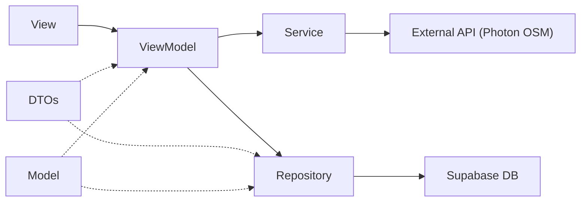

# Refactor Auth, Profile, Vehicle & Bengkel to Model → DTO → Repository → Service → ViewModel

Refactor four feature areas to follow the same layered architecture as the Order feature. Additionally, replace `MKLocalSearch` geocoding in Bengkel with the **same Photon OSM map + search UI** used in `OrderView`.

---

## ✅ Current Progress (as of 2026-05-27)

> [!IMPORTANT]
> **All planned refactoring steps are COMPLETE.** The Auth, Profile, Vehicle, and Bengkel features have been fully refactored to the layered architecture.

| Step | Status | Details |
|------|--------|---------|
| 1. DTOs | ✅ **Done** | `AuthDTOs.swift`, `VehicleDTOs.swift`, `BengkelDTOs.swift` created in `Models/DTOs/` |
| 2. Protocol | ✅ **Done** | `LocationSearchable` protocol created in `Protocols/` |
| 3. Repositories | ✅ **Done** | `UserRepository`, `VehicleRepository`, `BengkelRepository` created in `Repositories/` |
| 4. Services | ✅ **Done** | `AuthService`, `StorageService` created in `Services/` (alongside existing `LocationService`) |
| 5a. VehicleViewModel | ✅ **Done** | Delegates to `AuthService` + `VehicleRepository` |
| 5b. ProfileViewModel | ✅ **Done** | Delegates to `AuthService` + `UserRepository` + `StorageService` |
| 5c. AuthViewModel | ✅ **Done** | Delegates to `AuthService` + `UserRepository` |
| 5d. BengkelViewModel | ✅ **Done** | Major rewrite: `CLLocationManagerDelegate` + `LocationSearchable` + `LocationService` + `BengkelRepository`; `MKLocalSearch` removed |
| 5e. OrderViewModel | ✅ **Done** | Added `LocationSearchable` conformance |
| 6a. LocationSearchView | ✅ **Done** | Made generic over `LocationSearchable` protocol |
| 6b. RegisterBengkelView | ✅ **Done** | Rewritten with map + `LocationInputCard` + `LocationSearchView` |
| 6c. UpdateBengkelView | ✅ **Done** | Rewritten with map + `LocationInputCard` + `LocationSearchView`; pre-populates from existing bengkel |

### Remaining Work (Not in Original Plan)

| Item | Status | Notes |
|------|--------|-------|
| `CustomerBiddingViewModel` extraction | ⬜ **Not started** | Still uses direct `supabase.from()` calls — could be extracted to `BidRepository` + `BiddingService` |
| `MechanicBiddingViewModel` extraction | ⬜ **Not started** | Same as above — uses edge functions + realtime + direct queries |
| `OrderViewModel.createOrder()` | ⬜ **Not started** | Still has one direct `supabase.auth.session` call — could use `AuthService` |
| Payment & History features | ⬜ **Placeholder** | Empty directories — features not yet implemented |

## Decisions Resolved

- **Auth Service boundary → Option A**: `AuthService` wraps Supabase Auth SDK calls; `UserRepository` handles `users` table CRUD.
- **Bengkel geocoding → Reuse `LocationService`**: No new `GeocodingService`. Instead, `BengkelViewModel` gains the same map + address picker system as `OrderViewModel`, powered by the existing `LocationService`. `MKLocalSearch` is removed entirely.

## Reference Architecture



| Layer | Role | Example |
|-------|------|---------|
| **Model** | Domain entity matching DB schema | `User`, `Vehicle`, `Bengkel` |
| **DTO** | Encodable/Decodable payloads for insert/update/response | `ProfileUpdatePayload`, `VehicleUpdatePayload` |
| **Repository** | Single-purpose Supabase CRUD calls | `UserRepository`, `VehicleRepository` |
| **Service** | External API / SDK calls not tied to Supabase DB | `AuthService`, `LocationService` |
| **ViewModel** | Orchestrates Repository + Service; holds `@Published` UI state | `AuthViewModel`, `BengkelViewModel` |

---

## Proposed Changes

### 1. DTOs — New files

---

#### [NEW] [AuthDTOs.swift](file:///c:/Rei/UC/Semester%204/Mobile%20Application%20Development/Week%2016/MbengkelIn/MbengkelIn/Models/DTOs/AuthDTOs.swift)

```swift
import Foundation

// Used by AuthService for sign-up metadata
struct SignUpRequest {
    let email: String
    let password: String
    let name: String
    let phoneNumber: String
}

// Used by UserRepository to update the "users" table
struct ProfileUpdatePayload: Encodable {
    let name: String
    let phone_number: String
}

// Used by UserRepository to update profile image URL
struct ProfileImageUpdatePayload: Encodable {
    let profile_image_url: String
}
```

---

#### [NEW] [VehicleDTOs.swift](file:///c:/Rei/UC/Semester%204/Mobile%20Application%20Development/Week%2016/MbengkelIn/MbengkelIn/Models/DTOs/VehicleDTOs.swift)

```swift
import Foundation

struct VehicleUpdatePayload: Encodable {
    let manufacturer: String
    let model: String
    let year: Int
    let license_plate: String
    let color: String
}
```

---

#### [NEW] [BengkelDTOs.swift](file:///c:/Rei/UC/Semester%204/Mobile%20Application%20Development/Week%2016/MbengkelIn/MbengkelIn/Models/DTOs/BengkelDTOs.swift)

```swift
import Foundation

// Used by BengkelRepository for name/address/coordinate updates
struct BengkelUpdatePayload: Encodable {
    let name: String
    let address: String
    let latitude: Double
    let longitude: Double
}

// Used by BengkelRepository for offered_services array updates
struct BengkelServicesUpdatePayload: Encodable {
    let offered_services: [BengkelService]
}
```

---

### 2. Repositories — New files

---

#### [NEW] [UserRepository.swift](file:///c:/Rei/UC/Semester%204/Mobile%20Application%20Development/Week%2016/MbengkelIn/MbengkelIn/Repositories/UserRepository.swift)

Handles Supabase **database** operations on the `users` table.

```swift
class UserRepository {
    func fetchUser(uid: String) async throws -> User
    func updateProfile(uid: String, payload: ProfileUpdatePayload) async throws
    func updateProfileImageUrl(uid: String, payload: ProfileImageUpdatePayload) async throws
    func deleteUser(uid: String) async throws
}
```

**Extracted from**: [AuthViewModel.swift](file:///c:/Rei/UC/Semester%204/Mobile%20Application%20Development/Week%2016/MbengkelIn/MbengkelIn/ViewModels/AuthViewModel.swift#L82-L100) (`supabase.from("users")` calls) and [ProfileViewModel.swift](file:///c:/Rei/UC/Semester%204/Mobile%20Application%20Development/Week%2016/MbengkelIn/MbengkelIn/ViewModels/ProfileViewModel.swift#L37-L85) (profile update + image URL update).

---

#### [NEW] [VehicleRepository.swift](file:///c:/Rei/UC/Semester%204/Mobile%20Application%20Development/Week%2016/MbengkelIn/MbengkelIn/Repositories/VehicleRepository.swift)

```swift
class VehicleRepository {
    func fetchVehicles(customerId: String) async throws -> [Vehicle]
    func insertVehicle(_ vehicle: Vehicle) async throws
    func updateVehicle(vehicleId: String, payload: VehicleUpdatePayload) async throws
    func deleteVehicle(vehicleId: String) async throws
}
```

**Extracted from**: [VehicleViewModel.swift](file:///c:/Rei/UC/Semester%204/Mobile%20Application%20Development/Week%2016/MbengkelIn/MbengkelIn/ViewModels/VehicleViewModel.swift) (all `supabase.from("vehicles")` calls).

---

#### [NEW] [BengkelRepository.swift](file:///c:/Rei/UC/Semester%204/Mobile%20Application%20Development/Week%2016/MbengkelIn/MbengkelIn/Repositories/BengkelRepository.swift)

```swift
class BengkelRepository {
    func fetchBengkel(providerUid: String) async throws -> Bengkel
    func insertBengkel(_ bengkel: Bengkel) async throws
    func updateBengkel(bengkelId: String, payload: BengkelUpdatePayload) async throws
    func updateServices(bengkelId: String, payload: BengkelServicesUpdatePayload) async throws
    func deleteBengkel(bengkelId: String) async throws
}
```

**Extracted from**: [BengkelViewModel.swift](file:///c:/Rei/UC/Semester%204/Mobile%20Application%20Development/Week%2016/MbengkelIn/MbengkelIn/ViewModels/BengkelViewModel.swift) (all `supabase.from("bengkels")` calls).

---

### 3. Services — New files

---

#### [NEW] [AuthService.swift](file:///c:/Rei/UC/Semester%204/Mobile%20Application%20Development/Week%2016/MbengkelIn/MbengkelIn/Services/AuthService.swift)

Wraps the **Supabase Auth SDK** (not a DB table operation).

```swift
import Supabase

class AuthService {
    func getCurrentSession() async throws -> Session
    func signIn(email: String, password: String) async throws -> Session
    func signUp(request: SignUpRequest) async throws
    func signOut() async throws
    func resetPassword(email: String) async throws
}
```

**Extracted from**: [AuthViewModel.swift](file:///c:/Rei/UC/Semester%204/Mobile%20Application%20Development/Week%2016/MbengkelIn/MbengkelIn/ViewModels/AuthViewModel.swift) (all `supabase.auth.*` calls).

---

#### [NEW] [StorageService.swift](file:///c:/Rei/UC/Semester%204/Mobile%20Application%20Development/Week%2016/MbengkelIn/MbengkelIn/Services/StorageService.swift)

Wraps **Supabase Storage** for avatar uploads.

```swift
import Foundation
import Supabase

class StorageService {
    func uploadAvatar(uid: String, data: Data) async throws -> String  // returns public URL string
}
```

**Extracted from**: [ProfileViewModel.swift](file:///c:/Rei/UC/Semester%204/Mobile%20Application%20Development/Week%2016/MbengkelIn/MbengkelIn/ViewModels/ProfileViewModel.swift#L69-L75).

---

#### [UNCHANGED] [LocationService.swift](file:///c:/Rei/UC/Semester%204/Mobile%20Application%20Development/Week%2016/MbengkelIn/MbengkelIn/Services/LocationService.swift)

Already provides:
- `searchOSM(query:coordinate:)` → used for address autocomplete
- `fetchAddress(from:)` → used for reverse geocoding from map pin

Both are sufficient for Bengkel address input. **No changes needed.**

---

### 4. ViewModels — Refactored

---

#### [MODIFY] [AuthViewModel.swift](file:///c:/Rei/UC/Semester%204/Mobile%20Application%20Development/Week%2016/MbengkelIn/MbengkelIn/ViewModels/AuthViewModel.swift)

Delegates to `AuthService` + `UserRepository`. Public API unchanged — **no View changes needed**.

```diff
 class AuthViewModel: ObservableObject {
+    private let authService = AuthService()
+    private let userRepository = UserRepository()

     func login(email: String, password: String) async {
-        let result = try await supabase.auth.signIn(...)
+        let session = try await authService.signIn(email: email, password: password)
-        self.userSession = result.user
+        self.userSession = session.user
     }

     func signUp(...) async {
-        let result = try await supabase.auth.signUp(...)
-        try await supabase.auth.signOut()
+        try await authService.signUp(request: SignUpRequest(...))
+        try await authService.signOut()
     }

     func fetchUser() async {
-        var fetchedUser: User = try await supabase.from("users").select()...
+        var fetchedUser = try await userRepository.fetchUser(uid: uid)
+        let session = try await authService.getCurrentSession()
+        fetchedUser.email = session.user.email
     }

     func sendPasswordResetEmail() async {
-        try await supabase.auth.resetPasswordForEmail(email)
+        try await authService.resetPassword(email: email)
     }

     func deleteAccount(password: String) async {
-        _ = try await supabase.auth.signIn(...)
-        try await supabase.from("users").delete()...
-        try await supabase.auth.signOut()
+        _ = try await authService.signIn(email: email, password: password)
+        try await userRepository.deleteUser(uid: ...)
+        try await authService.signOut()
     }

     func signOut() {
-        try await supabase.auth.signOut()
+        try await authService.signOut()
     }
 }
```

**Views using this VM** (no changes needed — public API identical):
- [LoginView.swift](file:///c:/Rei/UC/Semester%204/Mobile%20Application%20Development/Week%2016/MbengkelIn/MbengkelIn/Views/Pages/Authentication/LoginView.swift), [RegistrationView.swift](file:///c:/Rei/UC/Semester%204/Mobile%20Application%20Development/Week%2016/MbengkelIn/MbengkelIn/Views/Pages/Authentication/RegistrationView.swift), [DashboardView.swift](file:///c:/Rei/UC/Semester%204/Mobile%20Application%20Development/Week%2016/MbengkelIn/MbengkelIn/Views/Pages/Dashboard/DashboardView.swift), [ProfileView.swift](file:///c:/Rei/UC/Semester%204/Mobile%20Application%20Development/Week%2016/MbengkelIn/MbengkelIn/Views/Pages/Profile/ProfileView.swift), [BengkelProfileView.swift](file:///c:/Rei/UC/Semester%204/Mobile%20Application%20Development/Week%2016/MbengkelIn/MbengkelIn/Views/Pages/Bengkel/BengkelProfileView.swift), [BengkelDashboardView.swift](file:///c:/Rei/UC/Semester%204/Mobile%20Application%20Development/Week%2016/MbengkelIn/MbengkelIn/Views/Pages/Bengkel/BengkelDashboardView.swift)

---

#### [MODIFY] [ProfileViewModel.swift](file:///c:/Rei/UC/Semester%204/Mobile%20Application%20Development/Week%2016/MbengkelIn/MbengkelIn/ViewModels/ProfileViewModel.swift)

Delegates to `AuthService`, `UserRepository`, `StorageService`. Public API unchanged — **no View changes needed**.

```diff
 class ProfileViewModel: ObservableObject {
+    private let authService = AuthService()
+    private let userRepository = UserRepository()
+    private let storageService = StorageService()

     func updateProfile(name: String, phoneNumber: String) async -> Bool {
-        guard let session = try? await supabase.auth.session else { ... }
+        guard let session = try? await authService.getCurrentSession() else { ... }
-        struct ProfileUpdate: Encodable { ... }       // removed inline struct
-        try await supabase.from("users").update(...)
+        let payload = ProfileUpdatePayload(name: name, phone_number: phoneNumber)
+        try await userRepository.updateProfile(uid: uid, payload: payload)
     }

     func uploadProfileImage(_ data: Data) async -> Bool {
-        // 15 lines of inline storage + DB code
+        let publicURLString = try await storageService.uploadAvatar(uid: uid, data: data)
+        let payload = ProfileImageUpdatePayload(profile_image_url: publicURLString)
+        try await userRepository.updateProfileImageUrl(uid: uid, payload: payload)
     }
 }
```

**Views using this VM** (no changes needed):
- [UpdateProfileView.swift](file:///c:/Rei/UC/Semester%204/Mobile%20Application%20Development/Week%2016/MbengkelIn/MbengkelIn/Views/Pages/Profile/UpdateProfileView.swift), [ProfileView.swift](file:///c:/Rei/UC/Semester%204/Mobile%20Application%20Development/Week%2016/MbengkelIn/MbengkelIn/Views/Pages/Profile/ProfileView.swift)

---

#### [MODIFY] [VehicleViewModel.swift](file:///c:/Rei/UC/Semester%204/Mobile%20Application%20Development/Week%2016/MbengkelIn/MbengkelIn/ViewModels/VehicleViewModel.swift)

Delegates to `AuthService` + `VehicleRepository`. Public API unchanged — **no View changes needed**.

```diff
 class VehicleViewModel: ObservableObject {
+    private let authService = AuthService()
+    private let vehicleRepository = VehicleRepository()

     func fetchVehicles() async {
-        guard let session = try? await supabase.auth.session else { return }
+        guard let session = try? await authService.getCurrentSession() else { return }
-        let fetchedVehicles: [Vehicle] = try await supabase.from("vehicles")...
+        let fetchedVehicles = try await vehicleRepository.fetchVehicles(customerId: uid)
     }

     func addVehicle(...) async -> Bool {
-        try await supabase.from("vehicles").insert(newVehicle).execute()
+        try await vehicleRepository.insertVehicle(newVehicle)
     }

     func updateVehicle(...) async -> Bool {
-        struct VehicleUpdate: Encodable { ... }       // removed inline struct
-        try await supabase.from("vehicles").update(...)
+        let payload = VehicleUpdatePayload(...)
+        try await vehicleRepository.updateVehicle(vehicleId: vehicleId, payload: payload)
     }

     func deleteVehicle(vehicleId: String) async {
-        try await supabase.from("vehicles").delete()...
+        try await vehicleRepository.deleteVehicle(vehicleId: vehicleId)
     }
 }
```

**Views using this VM** (no changes needed):
- [VehicleFormView.swift](file:///c:/Rei/UC/Semester%204/Mobile%20Application%20Development/Week%2016/MbengkelIn/MbengkelIn/Views/Pages/Profile/VehicleFormView.swift), [VehicleCardRow.swift](file:///c:/Rei/UC/Semester%204/Mobile%20Application%20Development/Week%2016/MbengkelIn/MbengkelIn/Views/Components/Features/AuthAndProfile/VehicleCardRow.swift), [ProfileView.swift](file:///c:/Rei/UC/Semester%204/Mobile%20Application%20Development/Week%2016/MbengkelIn/MbengkelIn/Views/Pages/Profile/ProfileView.swift)

---

#### [MODIFY] [BengkelViewModel.swift](file:///c:/Rei/UC/Semester%204/Mobile%20Application%20Development/Week%2016/MbengkelIn/MbengkelIn/ViewModels/BengkelViewModel.swift)

> [!IMPORTANT]
> **Major change**: This is the biggest refactor. Beyond the Repository/Service extraction, the ViewModel gains the **same map + address picker system** as [OrderViewModel](file:///c:/Rei/UC/Semester%204/Mobile%20Application%20Development/Week%2016/MbengkelIn/MbengkelIn/ViewModels/OrderViewModel.swift):
> - `CLLocationManagerDelegate` for GPS
> - `LocationService` for Photon OSM search + reverse geocode
> - `@Published` properties for `locationAddress`, `isEditingLocation`, `isFetchingLocation`, `searchResults`, `region`
> - Methods: `useCurrentLocation()`, `selectSearchResult()`, `updateLocationFromMap()`, debounced search via Combine
>
> `MKLocalSearch` is completely removed.

```diff
-class BengkelViewModel: ObservableObject {
+class BengkelViewModel: NSObject, ObservableObject, CLLocationManagerDelegate {
+    private let authService = AuthService()
+    private let bengkelRepository = BengkelRepository()
+    private let locationService = LocationService()
+    private let locationManager = CLLocationManager()
+    private var cancellables = Set<AnyCancellable>()
-    struct BengkelUpdateRequest: Encodable { ... }   // removed inline struct

+    // ── Location / Map state (same pattern as OrderViewModel) ──
+    @Published var locationAddress: String = ""
+    @Published var isEditingLocation: Bool = false
+    @Published var isFetchingLocation: Bool = false
+    @Published var searchResults: [PhotonSearchFeature] = []
+    @Published var region = MKCoordinateRegion(
+        center: CLLocationCoordinate2D(latitude: -7.2845, longitude: 112.6315),
+        span: MKCoordinateSpan(latitudeDelta: 0.01, longitudeDelta: 0.01)
+    )

+    override init() {
+        super.init()
+        locationManager.delegate = self
+        locationManager.desiredAccuracy = kCLLocationAccuracyBest
+        // Debounced search (identical to OrderViewModel)
+        $locationAddress
+            .debounce(for: .milliseconds(400), scheduler: RunLoop.main)
+            .removeDuplicates()
+            .sink { [weak self] query in ... }
+            .store(in: &cancellables)
+    }

+    // CLLocationManagerDelegate methods (same as OrderViewModel)
+    func useCurrentLocation() { ... }
+    func selectSearchResult(_ result: PhotonSearchFeature) { ... }
+    func updateLocationFromMap(coordinate: CLLocationCoordinate2D) { ... }
+    // + locationManager delegate callbacks

     func registerBengkel(name: String, address: String) async -> Bool {
-        guard let session = try? await supabase.auth.session else { ... }
+        guard let session = try? await authService.getCurrentSession() else { ... }
-        // MKLocalSearch for geocoding (removed)
-        let request = MKLocalSearch.Request()
-        request.naturalLanguageQuery = address
+        // Coordinates come from region.center (set by map/search picker)
+        let lat = region.center.latitude
+        let lon = region.center.longitude
         let newBengkel = Bengkel(..., latitude: lat, longitude: lon, ...)
-        try await supabase.from("bengkels").insert(newBengkel).execute()
+        try await bengkelRepository.insertBengkel(newBengkel)
     }

     func updateBengkel(bengkelId: String, name: String, address: String) async -> Bool {
-        // MKLocalSearch (removed)
+        let payload = BengkelUpdatePayload(
+            name: name, address: address,
+            latitude: region.center.latitude,
+            longitude: region.center.longitude
+        )
-        try await supabase.from("bengkels").update(...)
+        try await bengkelRepository.updateBengkel(bengkelId: bengkelId, payload: payload)
     }

     // fetchMyBengkel, deleteBengkel → use bengkelRepository / authService
     // addService, updateService, deleteService → use bengkelRepository
 }
```

> [!NOTE]
> The `registerBengkel` and `updateBengkel` signatures change subtly: the `address` parameter is still passed for the DB record, but **coordinates now come from `region.center`** (set by the map/search picker), not from geocoding the address string.

---

### 5. View Components — Make location search reusable

Currently [LocationSearchView](file:///c:/Rei/UC/Semester%204/Mobile%20Application%20Development/Week%2016/MbengkelIn/MbengkelIn/Views/Components/Features/Order/LocationSearchView.swift) and [LocationInputCard](file:///c:/Rei/UC/Semester%204/Mobile%20Application%20Development/Week%2016/MbengkelIn/MbengkelIn/Views/Components/Features/Order/LocationInputCard.swift) are reusable already — they take bindings and closures. However, `LocationSearchView` is **tightly coupled** to `OrderViewModel` via `@ObservedObject var viewModel: OrderViewModel`.

We introduce a **protocol** so both `OrderViewModel` and `BengkelViewModel` can drive the same UI:

---

#### [NEW] Protocol: `LocationSearchable`

Defines the shared contract for any ViewModel that supports the map + search address picker pattern. We place this in a new file alongside `LocationService`:

```swift
// File: Services/LocationSearchable.swift (or a shared Protocols/ folder)
import MapKit

@MainActor
protocol LocationSearchable: ObservableObject {
    var locationAddress: String { get set }
    var isEditingLocation: Bool { get set }
    var isFetchingLocation: Bool { get }
    var searchResults: [PhotonSearchFeature] { get }
    var region: MKCoordinateRegion { get set }

    func useCurrentLocation()
    func selectSearchResult(_ result: PhotonSearchFeature)
    func updateLocationFromMap(coordinate: CLLocationCoordinate2D)
}
```

---

#### [MODIFY] [LocationSearchView.swift](file:///c:/Rei/UC/Semester%204/Mobile%20Application%20Development/Week%2016/MbengkelIn/MbengkelIn/Views/Components/Features/Order/LocationSearchView.swift)

Change from concrete `OrderViewModel` to generic `LocationSearchable`:

```diff
-struct LocationSearchView: View {
-    @ObservedObject var viewModel: OrderViewModel
+struct LocationSearchView<VM: LocationSearchable>: View {
+    @ObservedObject var viewModel: VM
     // ... rest of the body stays identical
 }
```

---

#### [MODIFY] [OrderView.swift](file:///c:/Rei/UC/Semester%204/Mobile%20Application%20Development/Week%2016/MbengkelIn/MbengkelIn/Views/Pages/Order/OrderView.swift)

No functional change — `LocationSearchView(viewModel: viewModel)` still works since `OrderViewModel` will conform to `LocationSearchable`. **Just re-compile**.

---

### 6. Bengkel Views — Rewritten with map + search UI

---

#### [MODIFY] [RegisterBengkelView.swift](file:///c:/Rei/UC/Semester%204/Mobile%20Application%20Development/Week%2016/MbengkelIn/MbengkelIn/Views/Pages/Bengkel/RegisterBengkelView.swift)

**Before**: Simple form with `CustomInputField` for address (plain text, no map).

**After**: Full-screen map picker with search, identical UX to [OrderView](file:///c:/Rei/UC/Semester%204/Mobile%20Application%20Development/Week%2016/MbengkelIn/MbengkelIn/Views/Pages/Order/OrderView.swift). Layout:
- Map background with center pin (reusing `OrderMapView`)
- Bottom sheet with: bengkel name field + `LocationInputCard` + submit button
- `LocationSearchView` overlay when editing address

```diff
 struct RegisterBengkelView: View {
     @StateObject private var viewModel = BengkelViewModel()
-    @State private var bengkelName = ""
-    @State private var bengkelAddress = ""

     var body: some View {
-        // Simple ScrollView form with CustomInputField for address
+        ZStack(alignment: .bottom) {
+            // Map with center pin (reuse OrderMapView)
+            OrderMapView(
+                region: $viewModel.region,
+                isEditing: viewModel.isEditingLocation,
+                onRegionChange: { viewModel.updateLocationFromMap(coordinate: $0) }
+            )
+
+            // Bottom sheet: name input + LocationInputCard + submit button
+            VStack(spacing: 0) {
+                LocationInputCard(
+                    address: $viewModel.locationAddress,
+                    isFocused: $viewModel.isEditingLocation,
+                    isFetchingLocation: viewModel.isFetchingLocation,
+                    onCurrentLocationTapped: viewModel.useCurrentLocation
+                )
+                // ... bengkelName TextField + Submit button
+            }
+
+            // Search overlay
+            if viewModel.isEditingLocation {
+                LocationSearchView(viewModel: viewModel)
+            }
+        }
     }
 }
```

> [!NOTE]
> The view adds a `@State private var bengkelName` for the name field. The address comes from `viewModel.locationAddress` and coordinates from `viewModel.region.center`.

---

#### [MODIFY] [UpdateBengkelView.swift](file:///c:/Rei/UC/Semester%204/Mobile%20Application%20Development/Week%2016/MbengkelIn/MbengkelIn/Views/Pages/Bengkel/UpdateBengkelView.swift)

**Before**: Simple form with `CustomInputField` for address.

**After**: Same map + search picker UI as the revised `RegisterBengkelView`. On `.onAppear`, pre-populate `viewModel.locationAddress` and `viewModel.region` from the existing `bengkel` data.

```diff
 struct UpdateBengkelView: View {
     @ObservedObject var bengkelViewModel: BengkelViewModel

     var body: some View {
-        // Simple ScrollView form with CustomInputField for address
+        ZStack(alignment: .bottom) {
+            OrderMapView(
+                region: $bengkelViewModel.region,
+                isEditing: bengkelViewModel.isEditingLocation,
+                onRegionChange: { bengkelViewModel.updateLocationFromMap(coordinate: $0) }
+            )
+            // Bottom sheet + LocationInputCard + save button
+            // LocationSearchView overlay when editing
+        }
     }
     .onAppear {
         self.name = bengkel.name
-        self.address = bengkel.address
+        bengkelViewModel.locationAddress = bengkel.address
+        bengkelViewModel.region = MKCoordinateRegion(
+            center: CLLocationCoordinate2D(latitude: bengkel.latitude, longitude: bengkel.longitude),
+            span: MKCoordinateSpan(latitudeDelta: 0.01, longitudeDelta: 0.01)
+        )
     }
 }
```

---

### 7. Models — No changes

All model files remain unchanged:
- [User.swift](file:///c:/Rei/UC/Semester%204/Mobile%20Application%20Development/Week%2016/MbengkelIn/MbengkelIn/Models/User.swift)
- [Vehicle.swift](file:///c:/Rei/UC/Semester%204/Mobile%20Application%20Development/Week%2016/MbengkelIn/MbengkelIn/Models/Vehicle.swift)
- [Bengkel.swift](file:///c:/Rei/UC/Semester%204/Mobile%20Application%20Development/Week%2016/MbengkelIn/MbengkelIn/Models/Bengkel.swift)
- [BengkelService.swift](file:///c:/Rei/UC/Semester%204/Mobile%20Application%20Development/Week%2016/MbengkelIn/MbengkelIn/Models/BengkelService.swift)

---

## File Summary

### New Files (9)

| Layer | File | Purpose |
|-------|------|---------|
| DTO | `Models/DTOs/AuthDTOs.swift` | `SignUpRequest`, `ProfileUpdatePayload`, `ProfileImageUpdatePayload` |
| DTO | `Models/DTOs/VehicleDTOs.swift` | `VehicleUpdatePayload` |
| DTO | `Models/DTOs/BengkelDTOs.swift` | `BengkelUpdatePayload`, `BengkelServicesUpdatePayload` |
| Repository | `Repositories/UserRepository.swift` | CRUD on `users` table |
| Repository | `Repositories/VehicleRepository.swift` | CRUD on `vehicles` table |
| Repository | `Repositories/BengkelRepository.swift` | CRUD on `bengkels` table |
| Service | `Services/AuthService.swift` | Supabase Auth SDK wrapper |
| Service | `Services/StorageService.swift` | Supabase Storage wrapper |
| Protocol | `Protocols/LocationSearchable.swift` | Shared protocol for map+search VMs |

### Modified Files (6)

| File | Change Summary |
|------|---------------|
| `ViewModels/AuthViewModel.swift` | Replace inline Supabase calls → `AuthService` + `UserRepository` |
| `ViewModels/ProfileViewModel.swift` | Replace inline calls → `AuthService` + `UserRepository` + `StorageService` |
| `ViewModels/VehicleViewModel.swift` | Replace inline calls → `AuthService` + `VehicleRepository` |
| `ViewModels/BengkelViewModel.swift` | Major rewrite: add `CLLocationManagerDelegate`, location state, `LocationService`; remove `MKLocalSearch`; use `AuthService` + `BengkelRepository` |
| `Views/Components/Features/Order/LocationSearchView.swift` | Make generic over `LocationSearchable` protocol |
| `Views/Pages/Bengkel/RegisterBengkelView.swift` | Rewrite with map + `LocationInputCard` + `LocationSearchView` |
| `Views/Pages/Bengkel/UpdateBengkelView.swift` | Rewrite with map + `LocationInputCard` + `LocationSearchView`; pre-populate from existing bengkel |

### Unchanged Files
- All **Model** files
- [LocationService.swift](file:///c:/Rei/UC/Semester%204/Mobile%20Application%20Development/Week%2016/MbengkelIn/MbengkelIn/Services/LocationService.swift) — already provides everything needed
- [LocationInputCard.swift](file:///c:/Rei/UC/Semester%204/Mobile%20Application%20Development/Week%2016/MbengkelIn/MbengkelIn/Views/Components/Features/Order/LocationInputCard.swift) — already generic (uses bindings)
- [OrderMapView.swift](file:///c:/Rei/UC/Semester%204/Mobile%20Application%20Development/Week%2016/MbengkelIn/MbengkelIn/Views/Components/Features/Order/OrderMapView.swift) — already generic (uses bindings)
- [OrderView.swift](file:///c:/Rei/UC/Semester%204/Mobile%20Application%20Development/Week%2016/MbengkelIn/MbengkelIn/Views/Pages/Order/OrderView.swift) — compile-only (OrderViewModel conforms to new protocol)
- [OrderViewModel.swift](file:///c:/Rei/UC/Semester%204/Mobile%20Application%20Development/Week%2016/MbengkelIn/MbengkelIn/ViewModels/OrderViewModel.swift) — just add `LocationSearchable` conformance declaration
- [BengkelProfileView.swift](file:///c:/Rei/UC/Semester%204/Mobile%20Application%20Development/Week%2016/MbengkelIn/MbengkelIn/Views/Pages/Bengkel/BengkelProfileView.swift) — no change (delegates to `bengkelViewModel`)
- [BengkelServiceFormView.swift](file:///c:/Rei/UC/Semester%204/Mobile%20Application%20Development/Week%2016/MbengkelIn/MbengkelIn/Views/Pages/Bengkel/BengkelServiceFormView.swift) — no change

---

## Final Directory Structure

```
MbengkelIn/
├── Models/
│   ├── DTOs/
│   │   ├── OrderDTOs.swift            (existing)
│   │   ├── AuthDTOs.swift             ✨ NEW
│   │   ├── VehicleDTOs.swift          ✨ NEW
│   │   └── BengkelDTOs.swift          ✨ NEW
│   ├── User.swift                     (unchanged)
│   ├── Vehicle.swift                  (unchanged)
│   ├── Bengkel.swift                  (unchanged)
│   ├── BengkelService.swift           (unchanged)
│   └── ...
├── Protocols/
│   └── LocationSearchable.swift       ✨ NEW
├── Repositories/
│   ├── OrderRepository.swift          (existing)
│   ├── UserRepository.swift           ✨ NEW
│   ├── VehicleRepository.swift        ✨ NEW
│   └── BengkelRepository.swift        ✨ NEW
├── Services/
│   ├── LocationService.swift          (unchanged, reused by BengkelVM)
│   ├── AuthService.swift              ✨ NEW
│   └── StorageService.swift           ✨ NEW
├── ViewModels/
│   ├── AuthViewModel.swift            🔧 MODIFIED
│   ├── ProfileViewModel.swift         🔧 MODIFIED
│   ├── VehicleViewModel.swift         🔧 MODIFIED
│   ├── BengkelViewModel.swift         🔧 MAJOR REWRITE
│   ├── OrderViewModel.swift           📎 +conformance declaration
│   └── ...
└── Views/
    ├── Components/Features/Order/
    │   ├── LocationSearchView.swift   🔧 MODIFIED (generic)
    │   ├── LocationInputCard.swift    (unchanged)
    │   └── OrderMapView.swift         (unchanged)
    └── Pages/Bengkel/
        ├── RegisterBengkelView.swift  🔧 REWRITTEN (map picker)
        ├── UpdateBengkelView.swift    🔧 REWRITTEN (map picker)
        ├── BengkelProfileView.swift   (unchanged)
        ├── BengkelDashboardView.swift (unchanged)
        └── BengkelServiceFormView.swift (unchanged)
```

---

## Execution Order

1. **DTOs** — pure data structs, no dependencies
2. **Protocol** `LocationSearchable` — needed before VMs
3. **Repositories** — depend on DTOs + Models
4. **Services** (`AuthService`, `StorageService`) — depend on DTOs
5. **ViewModels** — refactor in order:
   - `VehicleViewModel` (simplest)
   - `ProfileViewModel`
   - `AuthViewModel`
   - `BengkelViewModel` (most complex — includes location system)
   - `OrderViewModel` (add `LocationSearchable` conformance)
6. **Views**:
   - `LocationSearchView` → make generic
   - `RegisterBengkelView` → rewrite with map picker
   - `UpdateBengkelView` → rewrite with map picker

---

## Verification Plan

### Build Verification
- Run `xcodebuild build` after each step to confirm zero compile errors

### Manual Verification
Test each flow in the app:
- **Auth**: Login → Register → Password Reset → Delete Account
- **Profile**: Update name/phone → Upload avatar
- **Vehicle**: Add → Edit → Delete vehicle
- **Bengkel Register**: Open register → pick location on map → search address → select result → enter name → submit
- **Bengkel Update**: Open edit → see pre-filled map pin at existing location → change address via search → save
- **Bengkel Services**: Add / Edit / Delete services (unchanged flow)
